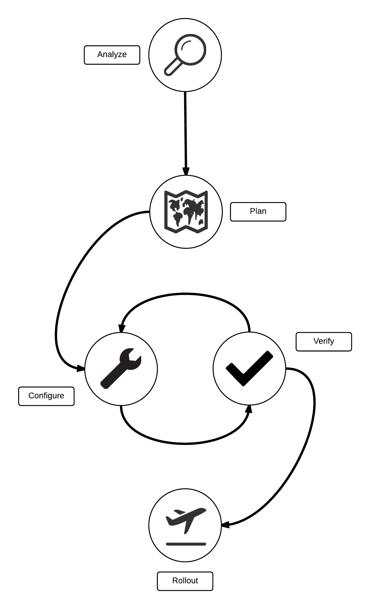
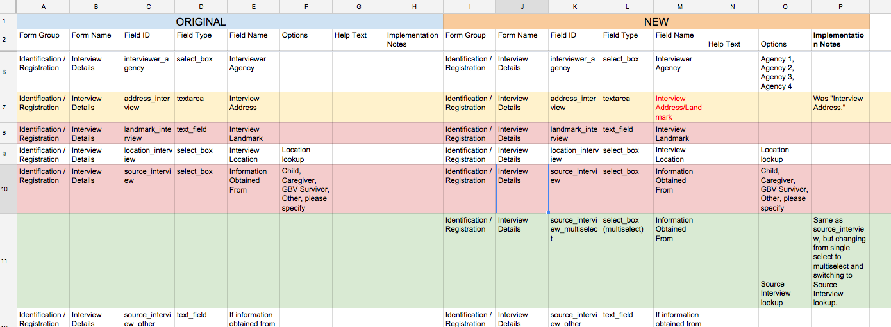

**Primero Configuration Process**

**Guide**

**Release 1.1.0**

November 2015

***Prepared for:***

3 United Nations Plaza

New York, NY 10017

> ***Prepared by:***
>
> 
>
> Quoin, Inc.

186 South Street, Suite 600

Boston, MA 02111

Overview
--------

Implementing Primero in a way that best fits your specific needs is a
process that consists of five steps: Analyze, Plan, Configure, Verify,
and Rollout.

Analyze
-------

Analysis is the beginning of your configuration process and where you
examine how Primero can be adjusted to meet the exact needs faced by
yours and other organizations in the area of interest. Primero can be
modified to meet these needs through a number of variables: Forms,
Lookups, Locations, Agencies, Agencies, Roles, User Groups, Reports,
Programs, Modules, Contact Information, and System Settings. While all
these elements of Primero are important, for many, adjusting them is a
simple matter of entering readily-available information that does not
require intense examination. Creating Agencies, for instance, will be a
simple act of entering information for those organizations currently
operating in the area of interest; no real examination aside from
writing up a basic list is needed to accomplish this. The variables that
require serious analysis, on the other hand--and thus the most important
for us to mention here--are Forms, Lookups, and Roles. For each one of
these variables, you will need to look at the goals your configuration
hopes to achieve, the sort of information you want to be able to
capture, and how different actors in the various organizations on the
ground will be interacting.

*Dos and Don’ts:*

It is important to note that while most of the variables we have
mentioned are easy enough to manage through Primero’s user interface,
Locations present a challenge due to the simple issue of how many
there usually are for a single implementation. Considering the
difficulty of hand-entering the names of thousands of villages,
cities, and districts into Primero, the best option for creating a
full set of locations is to contact Primero IT Support, who will be
able to automate the process for you. In other words, **DON’T**
attempt to add a large number of locations manually. **DO** contact
Primero IT Support to help you with the process.

The first of the above variables you will want to consider is the Role,
and depending on how you configure Roles, the Users you create later
on--Users are not handled by the configuration bundle; see **Primero
Administration and Configuration Guide**--will quickly fall into place.
After all, a User is only as good as its Role, which allows it to view
and edit information. When you do consider your Roles, you must think of
the interactions that take place on a daily basis between actors. What
types of workers are there in the various organizations on the ground?
What is their organizational structure? Who is privy to what
information? How do they exchange information, and who needs to give
approval before this kind of exchange can take place? If the
organizations you find have radically different structures, what
commonalities do they have in their operations, and how can a set of
roles be created that facilitates interactions based on those
commonalities?

The second variable you will want to consider is the Form. Here, you
will consider what kinds of information you need to be collecting.
Primero comes with a set of default Forms, and these will provide you
with a base from which to build out your own. Once again, you will need
to ask yourself a number of questions about what sort of information you
want to be gathering. The answer to each will have consequences for how
you plan out your Forms. Who do you want to be able to see the
information? If you want to keep certain people from viewing the
response to a question, then you may want to keep a field in its own
Form Section that only certain roles have access to. Will interviewees
need to convey a complex answer the details of which are highly
important? Then perhaps you should have a textarea field to capture
these details. Do you want to be able to view aggregated responses to a
question in a report? Then in this case a textarea is probably
inappropriate, and you would do better to use a radio or drop down
field, where the range of responses is limited to a set few.

Plan
----

Once you have an idea for what sorts of changes you want to make to the
baseline configuration of Primero, it is usually a good idea to map out
these changes to make them as comprehensible as possible. This way,
while you are making changes, and afterwards, when you are trying to
keep track of what changed and why, you have written documentation of
everything you have done.

Generally, this is achievable through a series of spreadsheets. For
tracking changes to forms, it is advisable to use a setup similar to the
one below:

Here, you can see the page divided into “Original” and “New” sections.
Each field, represented by a row, is is catalogued on each side of the
spreadsheet as its own row. The columns are as follows: the form group
and form in which the field belongs; the field’s ID, type, and name; any
options to be used for radio buttons, check boxes, and drop downs; and a
space for notes on why specific fields are outlined the way they are.
When there are changes between the “Original” (left) and “New” (right)
sides of the sheet, the row is highlighted yellow to reflect this, and
any specific columns that have changed are marked with red text. Any
deleted fields are highlighted red, and new fields are highlighted
green. For organizational purposes, it helps to keep a separate sheet
within the spreadsheet for each individual form section. For instance,
in the spreadsheet above, the “Interview Details” form section has been
given its own sheet within the forms spreadsheet. The
“address\_interviewer” field has had its name changed, so the entire row
is highlighted in yellow, and the “Field Name” column in that row has
red text. Meanwhile, the “landmark\_interview” and “source\_interview”
fields have been deleted, and thus their rows are highlighted in red.
Below these, there is a row for a new field,
“source_interview_multiselect,” appropriately highlighted in green.

*Dos and Don’ts:*

> An important thing to note here is the “Implementation Notes” column
> for the “source\_interview\_multiselect” field, which notes that the
> field is basically a copy of the deleted “source\_interview” field
> above it, but with a new database name, and a multi-select drop down
> as its field type instead of single-select. The user has done this
> because it is highly inadvisable to change the field type of an
> existing field, especially if users have already saved data in the
> field. Instead, the user has created a new field with a new field ID
> that looks exactly the same as the old one, except for the fact that
> its field type has been changed to a multi-select dropdown. If you
> ever encounter a situation in which you want to change the type of a
> field, this is a good model to follow. In short, **DON’T** change the
> field type of an already-existing field. **DO** replace the old field
> by hiding or deleting it, and then creating a new field with a new
> database name and the new field type you want to use.

For Roles, it can be helpful to draw a simple organizational chart, and
then create a more detailed map of each role you want to create by way
of a spreadsheet. Since configuring roles also involves deciding which
roles each role can manage, it may also be helpful to draw out an
organizational tree, outlining which team members should be able to
manage each other’s roles’ permissions. For a more detailed description
of the permissions roles grant and the role management process, please
consult the Primero Administration and Configuration Guide.

Configure
---------

It is important to understand, before talking about configuration, that
the Configure and Verify stages are part and parcel of a cycle you will
go through each time you want to make a set of changes. The basic idea
behind the Configure/Verify cycle is to make a few small changes to your
configuration, check to see if those changes work, and then export a
configuration bundle to save your work before moving on to the next set
of changes. Moving in this iterative fashion lets you rewind changes
easily in case you make an error.

Furthermore, this process should not be done on your main
implementation. Instead, this should be done on a separate
implementation hosted on a laptop which is not set up to automatically
sync with any other instance. The Configure/Verify process is one that
can be precarious due to how much is being changed at once. If something
goes wrong in this process, you do not want it to be on an instance with
real data and real work depending on it. Once you have a final
configuration file that you know works, THEN AND ONLY THEN can you
import it into your main instance, a process explained in the “Rollout”
section below.

In keeping with the principle of leaving yourself a trail of
configuration files to fall back on, the first thing you should do
before you make any configuration changes at all is to export the
original configuration bundle for your main instance (the one which you
eventually want everyone to use), storing it, and then importing it into
your test instance so that you do not accidentally lose configuration
changes that had already been made to the main instance.

To do this, start off by following the steps for exporting a
configuration bundle outlined in the [*Primero Administration and
Configuration
Guide*](https://docs.google.com/document/u/1/d/1uE2S9lJ2kHu5cNMsrlidzpjEw-o0hSIh4VKS_FaV0FU/pub).
Once you have followed these steps, you should be left with a .zip file.
Double-click on it. A window will pop up asking you for the password to
decrypt your file.

Enter the password and submit, and a new file, with a different
extension, “.json,” will appear next to your .zip file.

This .json file is what you want to keep for later on. Once you have the
json file for the export, save it to a new folder where you will keep
all of your configuration files and name them clearly so you can find
them later if necessary.

Now that you have this baseline configuration file saved away, make sure
you import it into your test instance. Once again, this step is
essential so that any changes you make are made specifically to the
configuration as it currently stands on your main instance, and so that
you do not accidentally erase any configuration changes that have
already been made there. To import the config into your test instance,
follow the steps for importing a configuration bundle located in the
[*Primero Administration and Configuration
Guide*](https://docs.google.com/document/u/1/d/1uE2S9lJ2kHu5cNMsrlidzpjEw-o0hSIh4VKS_FaV0FU/pub).

Once this is done, you can start making your first set of changes on the
test instance. In general, your changes should be made in the following
order: **Lookups -&gt; Forms -&gt; Roles**. The reason for this is a
simple matter of dependency. Creating form fields often requires using
lookups; creating a role involves deciding which forms the role will
have access to. (You will also want to do this before creating user
accounts, since creating a user requires assigning that user a role.)
You can, of course, mix things up a little bit--for instance, creating a
form field and its lookups at the same time--but sticking to this
guideline will generally prevent you from trying to reference something
you forgot to create in the first place.

For information on how to actually make particular changes in Primero,
consult the [*Primero Administration and Configuration
Guide*](https://docs.google.com/document/u/1/d/1uE2S9lJ2kHu5cNMsrlidzpjEw-o0hSIh4VKS_FaV0FU/pub).
As a matter of practice, do not make too many changes at once; try
creating a form and a few of its text fields, a multi-select field and
its lookup, or a role and a user to which said role is assigned. Smaller
sets of changes are easier to reverse, and when something goes wrong
with such a small group, it is easier to tell what might have caused the
error. Once you have made your changes, it is time to verify them.

Verify
------

The best way to verify your changes is to simply save a record. Either
open a new record, or edit an existing one. From here, try to make
changes to all the fields on your record. As you are going through the
various form sections, also take a minute to make sure that the fields
look the way you imagine they should look. When you click on a drop
down, do the options you specified for that drop down appear?

Below is an example of simple steps that can help in this verification:

-   Navigate to the form/fields that were changed or added

    -   Are they in the right location/group?

    -   Are they the right type of field/form?

    -   Are the labels correct?

    -   If you have chosen to hide in view page, does it hide correctly?

-   Log in with any new roles you created or edited

    -   Does the user have the proper access to records/resources/actions?

    -   Does the user have the proper dashboard information?

-   Add similarly formatted test information into each of the new fields and forms and save (example: do not attempt to add “Old” in Age field, add the type of information the form is expecting)

    -   Does it save properly?

    -   When you navigate away from the form, then back, is any information lost?

-   Export the form/fields you created into Excel

    -   Did they show up in your export correctly?

When you are finally done adding information to your record, save it,
and see if your information saved correctly. If they did, and you have
encountered no errors, try creating and then exporting a report as well.
If all of this proceeds without error, it is time to export a
configuration bundle so you can save the changes you have made so far.
To do this, follow the steps for exporting a configuration bundle
outlined in the [*Primero Administration and Configuration
Guide*](https://docs.google.com/document/u/1/d/1uE2S9lJ2kHu5cNMsrlidzpjEw-o0hSIh4VKS_FaV0FU/pub).
Once you have followed these, you should be left with a .zip file.
Double-click on it. A window will pop up asking you for the password to
decrypt your file.

Enter the password and submit, and a new file, with a different
extension, “.json,” will appear next to your .zip file.

Move this .json file to the folder where you are keeping your
configuration files, and give it a name to distinguish it from the
others, preferably with the current date and a counter included. If you
make a lot of changes, seeing the date and and an order number on your
files will help you to remember the order in which your configuration
files were created, and thus the order in which your changes were made.

Once you have saved your new config file, you can move on to your next
set of changes and repeat the Configure/Verify process.

*Dealing with errors*

As you have seen from the ‘My Primero Configs’ folder, filled with
configuration files above, this cycle of configuring, verifying and
exporting will produce a list of changesets that will provide you with a
sort of timeline to which you can fall back and perform a “do-over” when
errors occur. If, for instance, after making the two sets of changes
represented by the two configuration files in the ‘My Primero Configs’
folder, you made an error trying to make a third set of changes, you
could simply go back to how your configuration looked after the second
set. To do this, you would simply import
“20150914-02-added-information-manager-role.json” back into Primero. For
instructions on how to import a configuration bundle into Primero,
please see the [*Primero Administration and Configuration
Guide*](https://docs.google.com/document/u/1/d/1uE2S9lJ2kHu5cNMsrlidzpjEw-o0hSIh4VKS_FaV0FU/pub).

Rollout
-------

Once you have configured and verified all of your changes successfully
and then exported your final config file, it is time to move these
changes over to your main instance. This should be done when no one is
using the system. If the instance already has a number of users, be sure
to communicate to all users that the system will be unavailable for use,
and if possible, perform your rollout at a time when very few users
would be using it anyway, such as the middle of the night. You will also
want to allow yourself some buffer time after rollout to verify that
everything is working, and if necessary, roll back your changes.

*Dos and Don’ts:*

> In situations where numerous users have their own local instance, it
> will be tempting for them to create their own reports, user groups, or
> any other resources that are managed by the configuration bundle. The
> problem with this habit is that any changes users make on their own
> will be lost when new configuration bundles not containing those
> changes are sent out by high-level administrators. For instance,
> imagine that a user in a field office decides to create their own
> report tallying the number of cases between the ages of 15 and 18, and
> that every month, an administrator at the national level sends out a
> new configuration bundle containing changes to roles, user groups,
> etc. If the field office user imports the configuration bundle sent
> out by the administrator, and it does not contain the new 15-18
> report, then the report will disappear from their instance. Therefore,
> if you are a high-level administrator overseeing configuration
> maintenance, DO make sure that other users have a means of sending you
> any configuration changes they want made so that you can distribute
> them in your configuration bundles. If you are a user who is not
> maintaining a deployment’s configuration bundles DO NOT make changes
> on your own without making sure they are part of the central
> configuration decision-making and distribution process.

The core of the process is actually as simple as it sounds: import the
configuration file (using the steps outlined in the [*Primero
Administration and Configuration
Guide*](https://docs.google.com/document/u/1/d/1uE2S9lJ2kHu5cNMsrlidzpjEw-o0hSIh4VKS_FaV0FU/pub))
and then verify that there are no errors editing and saving records.
(Please note that it may take a few seconds for all your configuration
changes to load once you have imported the configuration bundle. If you
do not see your changes show up immediately, wait fifteen seconds or so,
reload your page, and check again.) One practice that will help you
contain the footprint of such a verification process is to keep two or
three records which are to be used solely for verification and are very
clearly marked as such. (Giving them names such as “Configuration
Verification Record 1” should do the trick.) When you are verifying,
edit only these records, so that you do not leave behind a clutter of
unwanted, distracting verification data.

If you do encounter errors after importing the configuration bundle to
your main, try importing earlier versions of the bundle. This may allow
you to isolate which part of your configuration changes are causing the
error. If you still experience errors after trying a few older
configuration files, it is probably time to seek help from Primero IT
Support (see below).

After you have confirmed that your new configuration bundle is
functioning properly, it is time to distribute it to anyone running a
local instance of Primero which is synced with your main instance. From
your main instance, do one final configuration bundle export. When you
have downloaded your .zip file, do not decrypt it. Instead, send this
.zip file via email to whomever needs to import the file, this way, the
information contained in the file is secure. When sending the password
to decrypt the file to these same people, be sure to do it by a means
other than email--text, instant message, phone call, etc. This will make
it harder for the configuration bundle to be opened by someone other
than its intended recipients. When everyone hosting a local instance has
imported the new config bundle successfully, the process is complete.

Primero IT Support
------------------

Primero’s support process follows three basic levels. Level one is
comprised of issues that can be solved by in-country personnel, such as
an administrator at the national level. Lost passwords, for instance,
can be easily solved by members of the in-country staff. Level two
issues, on the other hand, require action by technical personnel who
have access to the servers running the main instance of Primero. Level
three, finally, consists of bugs: issues that require changing the
actual Primero source code. Most issues you will face when making
configuration changes will lie within the second level, and contacting
Primero IT Support will allow technical personnel to work with you to
solve your problem quickly.
